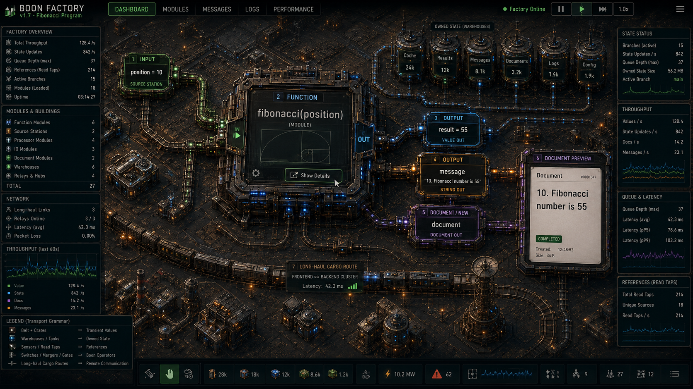
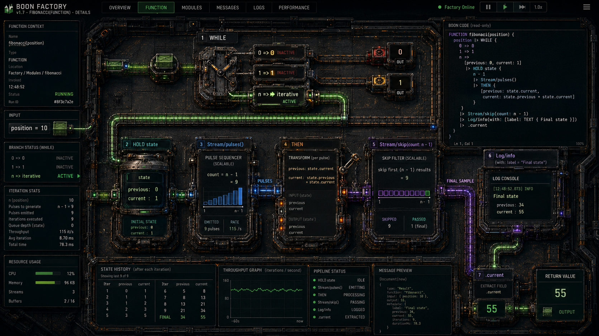

# Boon Orchard

## The Machines We Planted

Status: canonical game vision and visual seed, not an implementation,
compiler, CPU, console, Wasm, bridge, or verification contract. No game
implementation is scheduled by the current unified goal. Any future game
production requires a separate, user-approved specification after the
BoonConsole hardware-in-the-loop gate.

Implementation authority lives in
[`../architecture/BOON_CONSOLE.md`](../architecture/BOON_CONSOLE.md),
[`../plans/BOON_CONSOLE_IMPLEMENTATION_PLAN.md`](../plans/BOON_CONSOLE_IMPLEMENTATION_PLAN.md),
and
[`../plans/BOON_FIRST_RISCV_PROCESSOR_PLAN.md`](../plans/BOON_FIRST_RISCV_PROCESSOR_PLAN.md).
This file may name and visualize their real artifacts after they pass; it cannot
change their semantics or acceptance.

**Boon Orchard** is a game about growing a real computer from understandable,
verified parts and planting its finished machines into living worlds.

The first great construction goal is concrete:

> Build and prove BoonConsole: a working Boon-designed RISC-V processor,
> virtual and physical controls, and the same interpreted Boon `app.wasm`
> running on both the simulated and physical machine.

The processor is a reusable component of that goal, not a puzzle prop. Its
design is the same Boon source that runs in native and host-Wasm cycle
simulation, lowers to RTL, passes independent verification, and operates on an
FPGA.

When a processor is ready, it becomes the heart of a **machine lantern**: a
deployed processor/server site that brings useful computation to an island,
world, board, or real machine.

The emotional campaign name is:

> **The Machines We Planted**

It describes the central relationship: life and machinery becoming more capable
together. Industry is not automatically a poison, local life is not an enemy,
and progress is not measured by how completely the player replaces a place.

## Naming

| Name | Meaning |
| --- | --- |
| **Boon Orchard** | The game and the growing collection of machines |
| **The Machines We Planted** | Campaign name, subtitle, and emotional promise |
| **machine lantern** | One deployed processor/server site |
| **orchard** | The complete network of machine lanterns and living sites |
| **seed design** | A reusable verified Boon hardware module or processor |
| **mission** | The declared work assigned to a lantern; it may bind fiction and capabilities to an exact `app.wasm` digest |
| **`app.wasm`** | The canonical standalone BoonConsole application artifact |
| **`ConsolePort`** | Target-neutral logical buttons, switches, indicators, and fixed display frame |

`Boon Orchard` works because "orchard" means cultivation, patience, variation,
care, and a collection that becomes more valuable over time. "Boon" is both the
language and a benefit given to a place.

## The Core Fantasy

The player starts with signals, small logic elements, and an incomplete
understanding of a dormant machine network.

They do not unlock a finished CPU from a technology tree. They make one:

```text
BITS and signals
  -> combinational logic
  -> registers and state
  -> ALU
  -> register bank
  -> instruction decoder
  -> control state machine
  -> memory interface
  -> complete processor
  -> verified artifact
  -> machine lantern
  -> orchard of deployed machines
```

Each layer remains inspectable. The player can zoom from a world containing
several lanterns down through one lantern, one processor, one module, one
pipeline, and one changing bit.

The fantasy is not "pretend to be an electrical engineer." It is:

> I planted a machine I understand, I watched it wake, and its light is useful
> beyond the game.

## Story Seed

Across an archipelago of living worlds, old machine lanterns have gone quiet.
The places are not empty and they are not waiting to be conquered. Forests,
wetlands, settlements, migrating creatures, weather, and old infrastructure
continued without the network, each adapting differently.

The player inherits no master processor and no universal restoration key. They
inherit a small set of legible Boon designs, test instruments, and an unfinished
promise: rebuild the lanterns without making the worlds serve the machines.

The old network failed partly because it became opaque. Its machines could no
longer be understood, repaired, or safely adapted by the places depending on
them. The new orchard must be different:

- every machine has readable source;
- every important state change can be traced;
- every deployment declares its limits;
- every site can become dormant safely;
- every design can be tested before it is planted;
- every lantern must fit its place rather than flattening the place to fit it.

The campaign begins at a workbench and ends with a constellation of living
sites connected by machines the player actually built.

This is a seed, not locked lore. The important invariant is mutual adaptation,
not the exact cause of the old network's silence.

## Symbiosis Instead Of Extraction

Factorio's tension comes from an expanding industrial system poisoning and
provoking local fauna. Boon Orchard should deliberately explore another
relationship.

Machines still have costs:

- energy;
- material;
- heat;
- space;
- maintenance;
- latency;
- memory;
- network capacity;
- human and ecological attention.

But optimization is not simply extraction at a greater rate. Strong designs:

- reuse material;
- operate within local energy cycles;
- shed load instead of destroying a site;
- expose waste heat and resource pressure;
- enter safe dormant states;
- repair and reconfigure instead of being discarded;
- leave room for non-machine life;
- become more useful as local systems become healthier.

Fauna and flora are not waves of enemies. They can be:

- neighbors whose movement reveals whether a site is healthy;
- inhabitants that share structures, shade, heat, light, or routes;
- sources of changing constraints;
- beneficiaries and co-designers of the landscape;
- visible feedback when the player's optimization is locally harmful.

The game can still be demanding. Conflict comes from incompatible constraints,
limited knowledge, timing failures, storms, aging parts, overload, broken
links, stale state, and designs that work in simulation but not yet in their
environment.

Care is not a cosmetic morality meter. It is part of engineering.

## Primary Campaign Goal

The first campaign is complete when the player:

1. consumes an already passing BoonConsole proof bundle;
2. explores the real Boon-authored RV32I, console, interpreter, and application
   artifacts without a game-only implementation;
3. runs the exact proved standalone `app.wasm` through the virtual console;
4. optionally connects the equivalent physical console without unlocking
   otherwise unavailable campaign progress;
5. packages the proved machine as a machine lantern core;
6. plants the first lantern in a world;
7. assigns it a declared mission contract;
8. keeps it operating within computation, energy, storage, thermal, and
   ecological budgets;
9. connects several lanterns into a stable orchard.

The compiler, CPU, console, Wasm, bridge, and HIL artifacts may be prerequisites
for a separately specified future game; this document does not schedule that
work or allow a game to simulate those artifacts away.

The specific useful mission is deliberately **not chosen in this document**.
Choosing it too early would bend the processor, game, and deployment model
toward one app before the generic foundations are real.

The game should make a later mission genuinely useful, but it should not
pretend that "useful" has already been solved.

The useful application remains open. Its generic execution boundary does not:
missions bind a capability declaration to an exact, bounded `app.wasm`; all
required campaign controls work locally and virtually; physical FPGA and
remote-server deployments remain optional for campaign completion. The
console boundary is defined by
[`../architecture/BOON_CONSOLE.md`](../architecture/BOON_CONSOLE.md).
The older
[Mission Wasm And Lantern Consoles](./MISSION_WASM_AND_LANTERN_CONSOLES.md)
file is retained only as superseded history.

## What A Machine Lantern Is

A machine lantern is more than a server icon.

```text
machine lantern
  verified processor/core artifact
  target profile
  memory and storage
  source/input ports
  effect/output ports
  mission package
  capability and security boundary
  observability and trace data
  power/thermal/resource envelope
  local world relationship
```

The lantern can exist at several levels:

| Level | Meaning |
| --- | --- |
| Hardware simulation | The Boon processor/hardware artifact runs in the native or host-Wasm cycle simulator |
| Direct local app | Exact `app.wasm` runs in the independent PC reference interpreter with virtual I/O |
| Virtual Heart | The same `app.wasm` runs in the interpreter on the simulated Boon RV32I SoC |
| Physical BoonConsole | The same `app.wasm` runs in the interpreter on physical Boon RV32I and owns all console decisions |
| Server/site | Connects the game representation to an authorized real deployment |

The game world must label which level is active. A simulated lantern cannot be
presented as physical hardware, and a visual animation cannot be presented as
real server evidence.

Moving a processor to another island or world means packaging the same verified
core with a new target profile, shell, ports, and mission—not rewriting a hidden
game-only CPU.

The canonical app executes directly as Wasm in the PC oracle and as the exact
same Wasm bytes through the interpreter on simulated and physical Boon RV32I.
The game must label those placements honestly. Every required physical-console
interaction has an equivalent virtual console, and no board or paid server is
a campaign prerequisite.

## Three Scales Of Play

### Orchard Scale

The player sees worlds, islands, paths, weather, resources, and machine
lanterns.

This scale answers:

- Which sites are awake?
- What does each lantern promise?
- Which limits are close?
- What is flowing between sites?
- Which site needs redesign rather than more resources?
- How does the orchard affect and depend on local life?

The network should resemble a constellation of warm, distinct places, not a
single gray factory copied over the map.

### Lantern Scale

The player enters one deployed machine.

This scale contains:

- processor and attached modules;
- state and storage;
- mission boundary;
- input/effect gateways;
- live load;
- queues and backpressure;
- traces, failures, and repair history;
- local power, thermal, and capacity budgets.

The lantern is a place that can be understood spatially. Modules are rooms,
clearings, trellises, channels, or nested structures, but every visual object
must still correspond to a real artifact or measured state.

### Machine Interior Scale

The player enters the processor or one of its components.

This scale shows:

- register and current/pending state;
- combinational paths;
- instruction decode;
- ALU operations;
- finite-state-machine state;
- register-bank reads/writes;
- memory requests and waits;
- retirement;
- assertions and test failures;
- source-to-RTL artifact lineage.

The player can pause, step one clock, follow one instruction, compare expected
and actual values, and move between definition and live instance views.

## Four Synchronized Surfaces

The earlier game-authoring concept established three useful surfaces. Boon
Orchard keeps the principle and makes the world itself explicit:

```text
1. Source
   Canonical Boon source and target profiles.

2. Machine
   Spatial, nested view of the checked graph and its CoreHardwareIR and
   TargetHardwareIR projections.

3. Proof
   Simulation, traces, assertions, resource reports, and failures.

4. Orchard
   Worlds, lantern deployments, relationships, and long-term operation.
```

Selection should synchronize where possible:

```text
world lantern
  -> deployed artifact
  -> processor instance
  -> module
  -> TargetHardwareIR resource
  -> CoreHardwareIR operation/state
  -> Boon source
  -> trace/proof evidence
```

The canonical source remains serious and reviewable. Spatial layout metadata is
editor/game data and must not change hardware or runtime behavior.

## Real Artifact Rule

The game may teach and visualize, but it may not fake completion.

Every major construction milestone corresponds to a real artifact:

| In-game milestone | Required artifact |
| --- | --- |
| Stable logic seed | Checked Boon plus deterministic truth-table trace |
| Register grove | Reset/clock/candidate/commit proof |
| ALU | BITS operation fixtures and synthesis result |
| Register bank | Bounded `MAP` layout and port proof |
| Decoder | Complete legal/illegal decode coverage |
| Processor heartbeat | Mixed program retires correctly |
| First fruit | Architectural tests and final signature pass |
| Lantern core | Native/Wasm/RTL artifact digests agree |
| Console reaction | Checked `ConsolePort` contract plus deterministic input/output trace |
| Portable mission | Exact `app.wasm`, profile, capability, and package digests |
| Virtual Heart | Interpreter identity, base-RV32I audit, and PC-oracle/simulated-SoC trace equivalence |
| First signal | Two-endpoint message trace with request and applied-acknowledgement identities |
| Partition recovery | Deterministic delay/loss/duplicate/partition report and final state digests |
| Planted lantern | Target/board or simulator report identifies the exact artifact |
| Physical mission, when used | Board, bitstream, kernel/interpreter, exact app, and logical-I/O equivalence evidence |

When a gate fails, the game world can dramatize the failure, but it must expose
the real reason:

- wrong bit;
- ambiguous write;
- stale input;
- missing bound;
- timing path;
- exhausted queue;
- mismatched signature;
- inaccessible address;
- unsupported target operation.

Progress is earned by making the system true, not by filling a cosmetic meter.

## Processor-Growing Progression

The campaign can use an organic vocabulary without hiding technical meaning.

### 1. Seeds: Bits And Logic

Build and test:

- constants and ports;
- bit slices and concatenation;
- gates and comparisons;
- mux/select;
- add/subtract and shifts.

The game introduces propagation, width, signed interpretation, and the
difference between current state and a combinational value.

### 2. Roots: State And Clock

Build:

- registers;
- reset;
- current/pending state;
- counters;
- a small FSM.

Roots make the design persistent. The visual metaphor must still show the
actual clock/commit boundary.

### 3. Groves: Repeated Typed Storage

Build:

- the bounded `MAP` register bank;
- two read ports;
- one committed write port;
- `x0`;
- compact activity/dirty visualization.

This milestone demonstrates why public `MAP` can become efficient physical
storage without adding a `MEMORY` keyword.

### 4. Branches: Decode And Control

Build:

- instruction formats;
- immediate extraction;
- legal/illegal decode;
- branch/jump decisions;
- control-state transitions.

One instruction can be followed from fetched bits to retirement.

### 5. Trunk: The Complete RV32I Core

Join:

- fetch;
- decode;
- execute;
- memory wait;
- writeback;
- retirement;
- trap/exit.

The processor is now one living machine rather than a collection of minigames.

### 6. Fruit: Proof

Run:

- unit fixtures;
- mixed programs;
- randomized differential cases;
- architectural tests;
- formal properties;
- generated RTL comparison;
- timing and resource checks.

A proof bundle is the fruit: portable evidence that the design is ready to be
planted.

### 7. Lantern: Deployment

Combine the processor with:

- a target profile;
- storage and ports;
- observability;
- a mission contract;
- a site-specific shell.

The player chooses where and under what limits the machine will live.

### 8. Mission: Portable Work

Bind a game mission to one exact checked `app.wasm`, use its declared
`ConsolePort` capabilities, and run it first on a local virtual lantern. The
same Wasm bytes can then run through the interpreter on the Virtual Heart and,
optionally, the already proved physical BoonConsole. Finishing RV32I alone does
not provide that application platform.

The first communication checkpoint sends one bounded message between two local
islands and distinguishes press, send, acceptance, application, and
acknowledgement. Delay, duplication, loss, and partition are tested before a
remote server is involved.

### 9. Orchard: Cooperation

Several lanterns exchange declared messages and state without losing their
local identity.

The challenge shifts from "can one CPU work?" to:

- can designs be upgraded safely?
- can a site fail without corrupting others?
- can work move when energy or capacity changes?
- can the network remain understandable?
- can the machines serve places without consuming them?

## Game Loops

### Build Loop

```text
observe requirement
  -> place/edit real Boon structure
  -> inspect types and bounds
  -> simulate
  -> trace a failure
  -> improve design
  -> pass proof
  -> package reusable seed
```

### Plant Loop

```text
survey site
  -> choose verified artifact and profile
  -> declare ports, capabilities, and budgets
  -> simulate local conditions
  -> deploy lantern
  -> compare predicted and observed behavior
```

### Mission Loop

```text
write mission behavior in Boon or another compatible language
  -> compile and validate app.wasm
  -> bind a virtual ConsolePort
  -> run deterministic local scenarios
  -> connect another local lantern
  -> test delay/loss/partition
  -> run through the Virtual Heart
  -> optionally plant on an FPGA or authorized server
```

### Tend Loop

```text
watch load and environment
  -> identify pressure/failure
  -> decide whether to schedule, resize, move, sleep, or redesign
  -> test change
  -> migrate safely
  -> preserve trace and history
```

### Orchard Loop

```text
connect lanterns
  -> define messages and authority
  -> test delay/loss/partition
  -> observe global and local effects
  -> improve resilience
  -> grow without losing legibility
```

## Challenge Without A Default Enemy

Useful sources of tension include:

- a design that passes instruction tests but misses timing;
- a fast clock that creates too much heat or energy pressure;
- a small memory profile that needs better representation;
- delayed responses and backpressure;
- repeated events that cannot be coalesced;
- a migration that must preserve durable state;
- a site with intermittent power or connection;
- a new board whose storage ports differ;
- an optimization that helps dense work but harms one-row latency;
- a hidden dependency that makes repair unsafe;
- seasonal or local constraints that reward dormancy and redistribution;
- old artifacts whose behavior is known only through traces.

These can be as strategically rich as combat while remaining faithful to the
project's values.

## Useful In The Real World, Later

The game is designed so the eventual mission can cross the boundary into a real
deployment.

That requires:

- explicit capabilities;
- authenticated external connections;
- exact artifact identity;
- separation between simulation and reality;
- observable inputs, outputs, and state;
- resource and failure budgets;
- safe update/migration;
- an emergency stop/dormant state;
- no hidden game privilege over a real machine.

The mission interface should be generic enough that a future useful workload
can be inserted without changing the processor proof or the meaning of a
machine lantern.

This document intentionally does not list candidate apps. The open space is a
design constraint, not an omission to fill casually.

## Visual Seeds

The two images below are the starting visual references from the earlier
conversation.

These are concept illustrations, not product screenshots. Their source text,
values, architecture, and telemetry are illustrative; they are not language
specifications, measurements, or proof evidence.

### System Overview



Carry forward:

- a whole system readable at a glance;
- strong hierarchy;
- visibly typed/color-coded flows;
- modules that look like places;
- live values near the machinery that owns them;
- routes connecting distant parts;
- telemetry around, not over, the main spatial model;
- the ability to enter a module.

### Machine Interior



Carry forward:

- zooming into a function or processor interior;
- a left-to-right causal path;
- distinct current state, transforms, filters, and output;
- synchronized code, state history, graphs, logs, and result;
- step/run controls;
- visible values on the path;
- clear numbered stages.

### What The Images Do Not Decide

The images say `BOON FACTORY` and use a dense, dark, extractive industrial
language. That is not the final name or final art direction.

Do not carry forward as defaults:

- endless black metal flooring;
- smoke, grime, or environmental damage as shorthand for progress;
- machines visually erasing the landscape;
- hostile local life;
- unreadably dense dashboard text;
- decorative telemetry with no real source;
- belts and crates for every abstract value;
- the idea that larger machinery is always better.

The new direction should combine:

- warm machine light;
- dark skies or sheltered interiors where lanterns are meaningful;
- living wood, leaves, roots, water, stone, ceramic, glass, and metal;
- visible repair, age, and reuse;
- cables and channels that coexist with paths, roots, and habitats;
- distinct local materials and forms for each site;
- calm dormant states as well as bright active states;
- technical precision without a sterile laboratory.

The machine should look planted and tended, not dropped onto conquered ground.

## Visual Grammar

Suggested meanings:

| Visual | Meaning |
| --- | --- |
| Warm steady light | Committed healthy state |
| Traveling pulse | Event that must not be lost |
| Soft changing glow | Coalescible current signal |
| Split current/draft vessel | Current and pending state |
| Root or trellis junction | Typed dependency/fanout |
| Ringed growth boundary | Clock/commit boundary |
| Lantern flame/core | Running processor |
| Fruit/seed capsule | Verified reusable artifact |
| Dim but intact site | Safe dormant machine |
| Flicker or broken rhythm | Timing, queue, or protocol fault |
| Encroaching heat/dryness | Resource pressure, not an enemy attack |

Color alone cannot carry type or failure information. Shape, motion, labels,
sound, and inspector details must remain accessible.

## Relationship To The Historical Idea

[`idea_1_old.md`](idea_1_old.md) preserves the earlier game-like Boon authoring
concept.

Carry forward from it:

- canonical Boon source;
- synchronized code, preview/machine, and visual surfaces;
- modules as nested places;
- definition view versus live instance view;
- static graph versus dynamic rows/state;
- deterministic replay and trace explanation;
- visual layout metadata that is non-semantic;
- frontend, backend, and FPGA domain awareness;
- no example-specific engine shortcuts.

Boon Orchard supersedes:

- the working names `Boon Foundry`, `Circuitorio`, and `Boon Circuit Studio`;
- the generic factory as the primary world metaphor;
- any visual terminology that suggests public `MEMORY`;
- any old language example that conflicts with current authoritative plans;
- the assumption that the authoring interface itself is the whole game.

The historical file remains useful design material, not the current
implementation contract.

## Technical Boundaries

- Boon source and checked artifacts determine behavior.
- Game layout never changes logic.
- The game uses the real compiler/typechecker/runtime/simulator.
- A compiler limitation is fixed generically, not hidden in game source.
- Dynamic rows or processor instances are runtime data, not cloned permanent
  graph nodes.
- Hidden IDs and generations remain inspector metadata.
- Time acceleration changes presentation speed, not event order or proof.
- A failed proof cannot be bypassed with an in-game currency.
- Real deployments require explicit user authorization and capability limits.
- No real external action is implied merely by placing a world object.
- `MAP`, not a new `MEMORY` keyword, is the public bounded keyed authority.
- Host-Wasm hardware simulation and portable `app.wasm` are distinct artifacts
  and must be labelled separately.
- Button meaning belongs to the checked mission; target shells only normalize
  physical and virtual I/O.
- Mission guests receive only declared bounded capabilities, not ambient
  filesystem, network, clock, or external-action authority.
- Virtual-cluster completion is mandatory; FPGA boards, Pmods, Raspberry Pis,
  paid hosting, and public servers are optional.
- A physical console cannot by itself authorize an external server action.
- A physical BoonConsole claim requires the exact original `app.wasm`, an
  explicit onboard interpreter, and matching HIL evidence.
- App install, state restore, reset, and recovery use the already proved
  BoonConsole protocol; the game cannot invent a second planting path.
- Self-hosting is neither a game goal nor a prerequisite; pursue it only if it
  later becomes independently useful.

## First Playable Slice

The first game slice begins only after the BoonConsole HIL gate is real. It
contains:

1. one small garden/workbench environment;
2. the real checked hardware fixtures and processor proof bundle;
3. machine-interior visualization generated from those artifacts;
4. step/run/reset through the published native or host-Wasm simulator API;
5. real assertion, timing, and resource failures visible in the proof surface;
6. the exact reference `app.wasm` running through the virtual `ConsolePort`;
7. deterministic layout and replay;
8. one reusable verified seed placed into a dormant lantern shell.

A compatible physical console is an optional extension for campaign progress,
but when connected it uses the already passing exact-byte interpreter and HIL
path. Later local lantern communication adds bounded request/acknowledgement,
delay, loss, duplication, and partition fixtures without changing console or
CPU correctness.

## Success Criteria

Boon Orchard is on the right path when:

- building the processor is understandable and satisfying without pretending
  the underlying work is simpler than it is;
- expert users can move from any visual object to real source and proof;
- players learn causality, state, timing, bounds, and verification by using
  them;
- the same processor artifact reaches native, host Wasm, RTL, and FPGA;
- a machine lantern feels like a useful inhabitant of a place;
- ecological health and machine capability reinforce each other mechanically;
- the world rewards repair, restraint, legibility, and adaptation;
- the complete game and server-like lantern cluster run on one local PC without
  purchased hardware or hosting;
- one checked mission behaves equivalently with virtual controls and optional
  compatible physical controls;
- every visible inter-island message resolves to a real bounded message trace;
- the game distinguishes the PC app oracle, host-Wasm hardware simulation,
  interpreted app execution on simulated RV32I, interpreted app execution on
  physical RV32I, and authorized server execution;
- the useful eventual mission can be chosen later without redesigning the
  foundations;
- the game remains meaningful even if self-hosting never happens.

## Open Decisions

Deliberately open:

- the first real-world mission;
- whether the primary world is an archipelago, small planets, or a seamless
  mixture of both;
- how much direct construction versus source editing each audience uses;
- the balance between authored campaign and open orchard;
- multiplayer/cooperative ownership;
- the fictional name and package metadata wrapped around canonical
  BoonConsole `app.wasm`;
- the authorization, transport, and state-migration policy beyond the required
  local virtual cluster;
- whether a later richer Wasm profile, multi-app loader, or network peripheral
  becomes justified beyond the proved BoonConsole V1;
- final art style, characters, and lore;
- whether a custom Boon-native processor follows RV32I inside the main campaign
  or a later campaign.

These decisions should follow prototypes and real technical progress.

## Final Promise

Boon Orchard should make this sentence true:

> We did not build a machine that consumed the world around it. We built a
> machine the world could live with, understood how it worked, and planted its
> light where it could become a boon.
